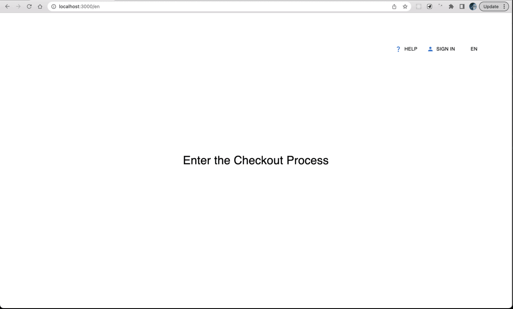

# A. Introduction

### a.1 react + next.js + i18n + Mui + sass

# B. Structure

### Files

| 1          | 2           | usage                                      |
| ---------- | ----------- | ------------------------------------------ |
| public/    |             |                                            |
|            | locales/    | calling from client to interior server     |
| src/       |             |                                            |
|            | components/ | handling the logic of UI                   |
|            | pages/      | handling the state of rendering components |
|            | styles/     | using sass                                 |
|            | views/      | handling the layout of the components      |
| fetcher.js |             | handling the api calling                   |

### the Others

| Kinds            | Thinking                                                                                                                                                                             |
| ---------------- | ------------------------------------------------------------------------------------------------------------------------------------------------------------------------------------ |
| Router system    | " domain/locales/checkout/[step]" had been used.                                                                                                                                     |
| State Management | In this app, "sessionstorage" was used to persist the data between changing URL; if possible, the redux-persist or reat query will be introduced in a much more compliacted scenario |
| i18n             | the locale data was prefixed in the next.config, so, every next/router object can catch the data of "locales"                                                                        |

# C. Getting Started

| I     | SOP                  |
| ----- | -------------------- |
| dev   | `yarn` -> `yarn dev` |
| build | `yarn build`         |
